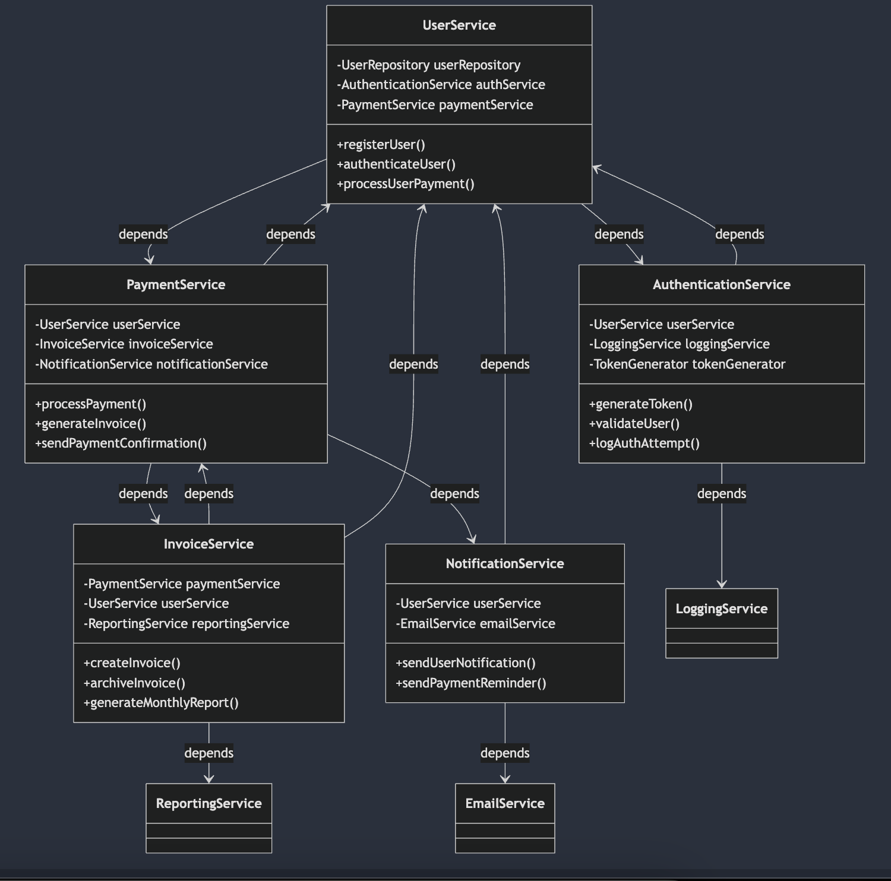

# Workflow and UseCase Pattern

## Overview

This project introduces a Workflow and UseCase pattern designed to address the challenges of high coupling in application service architectures. In typical implementations, a use case's business logic can be scattered across multiple services, making it implicit and difficult to maintain. This pattern:

- Organizes the business logic into clearly defined workflows and orchestrates them into cohesive use cases.
- Takes inspiration from functional programming by emphasizing function composition and typed error handling with algebraic data types (ADTs).
- Promotes clarity, maintainability, and loose coupling, ensuring that encapsulated workflows interact only through well-defined inputs and outputs.

<figure>
  
  <figcaption>Figure 1: High Coupling among services</figcaption>
</figure>

## Why Use This Pattern?

- **Function Composition:**  
  Leverages the power of composing small, focused workflows into larger, more complex use cases. Each workflow transforms an Input into an Output, facilitating a modular approach.

- **Typed Error Handling:**  
  Uses algebraic data types to provide explicit error handling without exceptions. This results in a more predictable flow and easier debugging.

- **Loose Coupling:**  
  Workflows are never directly coupled to each other. Instead, the Workflow DSL ensures that outputs are transformed into inputs for subsequent workflows, promoting clear separation of concerns.

## Features

### 1. Decoupled Workflow Execution

- **Independent Workflows:**  
  Each workflow is a self-contained unit that operates on an Input and produces a WorkflowResult, which contains:
  - **WorkflowContext:** Metadata about the execution (e.g., timing, status, or other diagnostic data).  
    _Note:_ This context must not duplicate the domain-specific output data.
  - **Event:** The main output that packages any domain data from a successful execution.

- **Assembly via DSL:**  
  Use the provided Workflow DSL to combine multiple workflows into a single UseCase instance. The DSL allows seamless transformation of one workflow’s output into the input for the next workflow.

### 2. Flexibility in Execution

- **Sequential or Parallel Execution:**  
  The DSL enables you to switch between sequential and parallel execution modes when building a UseCase, allowing performance tuning based on your needs.

### 3. Error Handling

Each workflow gracefully handles errors by returning an Either type. The proposed workflow errors include:

- **ValidationError:**  
  Indicates that the input data provided to the workflow is invalid. This error is created by workflow authors during input validation.

- **ExecutionError:**  
  Signifies a domain-specific error encountered during workflow processing.

- **ExceptionError:**  
  Captures any unexpected exceptions (e.g., SocketTimeoutException) that occur during the workflow execution. The pattern ensures that these are wrapped and do not propagate as thrown exceptions.

- **CompositionError:**  
  Created by the Workflow DSL when an error is encountered while transforming the output of one workflow into the input for the next workflow.

### 4. Usage Guidelines

#### What to Do

- **Understand the Pattern:**  
  Study the underlying principles of functional programming, especially function composition and typed error handling using ADTs.

- **Construct UseCases Correctly:**  
  There are two ways to create a UseCase instance:
  - **Explicit Construction:** Directly instantiate use cases with concrete classes.
  - **Using the DSL:** Assemble workflows with the Workflow DSL to take advantage of composable input/output transformation.

- **Leverage WorkflowContext:**  
  Utilize WorkflowContext in your transform functions, especially in helper DSL functions (like `thenIf`), to make informed decisions about whether to execute a subsequent workflow.

- **Embrace Flexibility:**  
  Choose sequential or parallel execution modes based on the specific performance requirements of your use case.

#### What Not to Do

- **Avoid High Coupling:**  
  **Never** allow a workflow to directly execute another workflow instance. All interactions should occur via the DSL to maintain loose coupling.

- **Do Not Duplicate Domain Data:**  
  The WorkflowContext should only contain metadata and not duplicate the domain data that is already encapsulated within the Event output.

- **Don’t Overcomplicate or Bypass the DSL:**  
  Avoid crafting custom inter-workflow invocation methods. Stay within the boundaries of the provided DSL to ensure consistency and maintainability.

## Additional Considerations

- **Performance Tuning:**  
  The capability to switch between sequential and parallel execution offers a powerful tool for performance optimization. Consider your application's needs to choose the appropriate mode.

- **Error Handling Philosophy:**  
  The explicit use of typed errors eliminates the risks associated with unhandled exceptions and keeps your domain logic predictable.

- **Future Extensions:**  
  While this document does not cover extending the DSL, the current implementation provides a solid foundation for building robust, loosely coupled use cases.

## Next Steps

- **Code Examples:**  
  Detailed code examples and usage samples will be added in subsequent sections to show step-by-step how to construct workflows and use cases with both explicit instantiation and the DSL.

- **Documentation Updates:**  
  As the project evolves, this README will be updated to include new features or improvements to the Workflow DSL and Error handling mechanisms.

---
